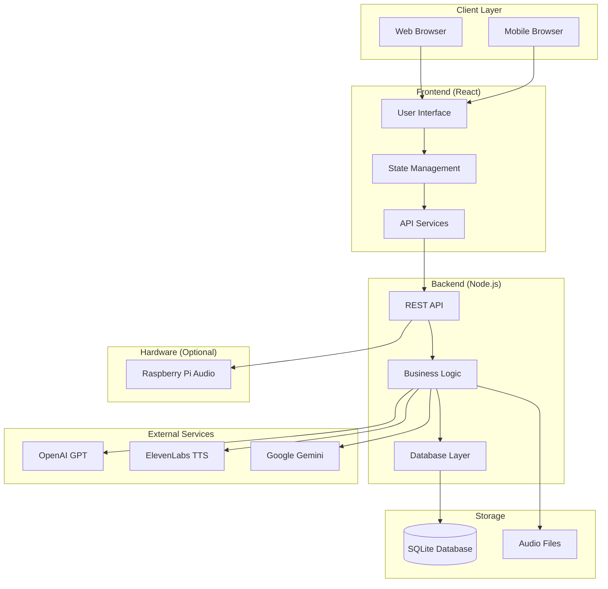
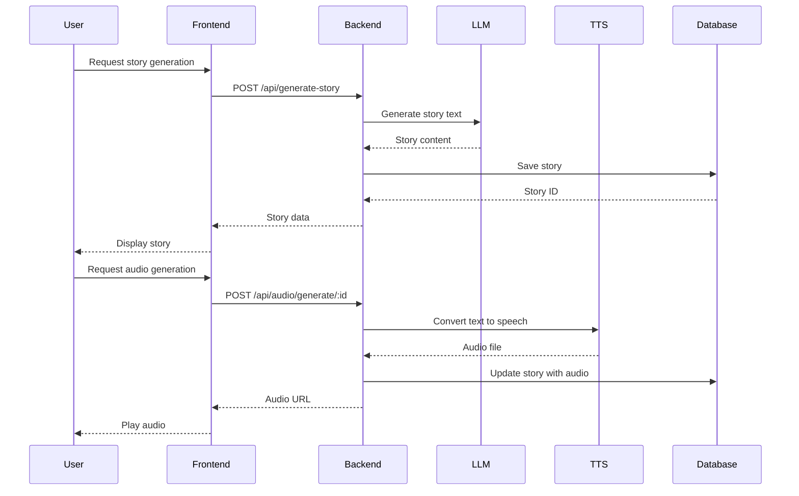
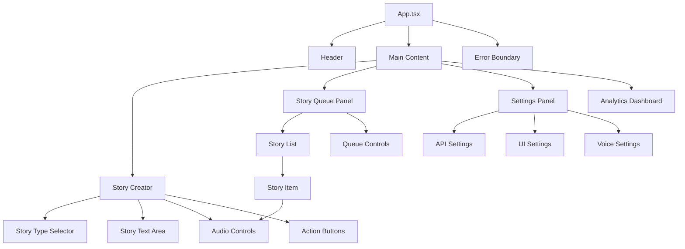
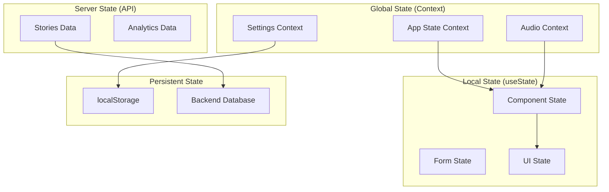

# Architecture Documentation - Bedtime Stories App

## System Overview

The Bedtime Stories App is a modern full-stack web application that generates personalized bedtime stories using AI language models and provides text-to-speech functionality. The architecture follows a clean separation between frontend and backend services, with support for multiple deployment targets including standard servers and Raspberry Pi devices.

## High-Level Architecture



## Technology Stack

### Frontend Stack
- **Framework**: React 19 with TypeScript
- **Build Tool**: Vite 6.x
- **Styling**: TailwindCSS 4.x
- **UI Components**: Radix UI + Shadcn/ui
- **State Management**: React Context + Hooks
- **HTTP Client**: Fetch API with custom services
- **Audio**: Web Audio API

### Backend Stack
- **Runtime**: Node.js 20+
- **Framework**: Express.js 5.x
- **Language**: TypeScript
- **Database**: SQLite3 with better-sqlite3
- **File Upload**: Multer
- **Logging**: Pino
- **Validation**: Joi

### External Integrations
- **LLM Services**: OpenAI GPT-4o-mini, Google Gemini
- **TTS Services**: ElevenLabs, Google Gemini TTS
- **STT Services**: OpenAI Whisper, Google Speech-to-Text

## Directory Structure

```
bedtime-stories-app/
├── src/                          # Frontend source
│   ├── components/               # React components
│   │   ├── ui/                  # Base UI components (Shadcn)
│   │   ├── StoryCreator.tsx     # Main story creation interface
│   │   ├── StoryQueuePanel.tsx  # Playlist management
│   │   ├── AudioControls.tsx    # Audio playback controls
│   │   └── Settings.tsx         # Application settings
│   ├── hooks/                   # Custom React hooks
│   │   ├── useAudioPlayer.ts    # Audio playback management
│   │   ├── useStoryDatabase.ts  # Database operations
│   │   └── useFavorites.ts      # Favorites management
│   ├── services/                # API and external services
│   │   ├── llmService.ts        # LLM integration
│   │   ├── ttsService.ts        # Text-to-speech
│   │   ├── databaseService.ts   # Database operations
│   │   └── analyticsService.ts  # Usage analytics
│   ├── utils/                   # Utility functions
│   │   ├── storyTypes.ts        # Story type definitions
│   │   ├── logger.ts            # Frontend logging
│   │   └── share.ts             # Sharing functionality
│   └── App.tsx                  # Main application component
├── backend/                     # Backend source
│   ├── services/                # Business logic services
│   │   ├── storyDatabase.ts     # Database operations
│   │   ├── llmService.ts        # LLM service integration
│   │   └── ttsService.ts        # TTS service integration
│   ├── database/                # Database files and migrations
│   │   ├── stories.db           # SQLite database
│   │   └── migrations/          # Database migrations
│   ├── audio/                   # Generated audio files
│   ├── middleware/              # Express middleware
│   └── server.ts                # Main server file
├── docs/                        # Documentation
├── public/                      # Static assets
└── dist/                        # Built application
```

## Data Architecture

### Database Schema

#### Core Tables
```sql
-- Stories table
CREATE TABLE stories (
  id INTEGER PRIMARY KEY AUTOINCREMENT,
  story_text TEXT NOT NULL,
  story_type TEXT NOT NULL,
  custom_topic TEXT,
  created_at DATETIME DEFAULT CURRENT_TIMESTAMP,
  is_favorite BOOLEAN DEFAULT 0,
  word_count INTEGER,
  reading_time INTEGER
);

-- Audio files table
CREATE TABLE audio_files (
  id INTEGER PRIMARY KEY AUTOINCREMENT,
  story_id INTEGER REFERENCES stories(id),
  file_name TEXT NOT NULL UNIQUE,
  file_size INTEGER,
  duration REAL,
  provider TEXT, -- 'elevenlabs', 'gemini'
  voice_id TEXT,
  created_at DATETIME DEFAULT CURRENT_TIMESTAMP
);

-- Full-text search table
CREATE VIRTUAL TABLE stories_fts USING fts5(
  story_text,
  custom_topic,
  content='stories',
  content_rowid='id'
);

-- Sharing table (future feature)
CREATE TABLE story_shares (
  id TEXT PRIMARY KEY, -- UUID
  story_id INTEGER REFERENCES stories(id),
  expires_at DATETIME,
  created_at DATETIME DEFAULT CURRENT_TIMESTAMP,
  access_count INTEGER DEFAULT 0
);

-- Analytics table
CREATE TABLE usage_analytics (
  id INTEGER PRIMARY KEY AUTOINCREMENT,
  event_type TEXT NOT NULL, -- 'story_generated', 'audio_played', etc.
  story_id INTEGER,
  metadata TEXT, -- JSON
  created_at DATETIME DEFAULT CURRENT_TIMESTAMP
);
```

#### Indexes
```sql
CREATE INDEX idx_stories_type ON stories(story_type);
CREATE INDEX idx_stories_favorite ON stories(is_favorite);
CREATE INDEX idx_stories_created ON stories(created_at DESC);
CREATE INDEX idx_audio_files_story ON audio_files(story_id);
CREATE INDEX idx_analytics_event ON usage_analytics(event_type, created_at);
```

### Data Flow



## Component Architecture

### Frontend Component Hierarchy



### Component Responsibilities

#### StoryCreator
- **Purpose**: Main interface for story creation and editing
- **Responsibilities**:
  - Story type selection
  - Custom topic input
  - Story text generation and editing
  - Audio generation and playback
  - Story saving and management

#### StoryQueuePanel
- **Purpose**: Playlist-style story management
- **Responsibilities**:
  - Story list display with drag-and-drop reordering
  - Batch operations (play, delete, favorite)
  - Queue management and persistence
  - Audio playback controls for each story

#### AudioControls
- **Purpose**: Audio playback interface
- **Responsibilities**:
  - Play/pause/stop controls
  - Progress tracking and seeking
  - Volume and playback speed control
  - Audio format support

#### Settings
- **Purpose**: Application configuration
- **Responsibilities**:
  - API key management
  - Provider selection (LLM/TTS)
  - Voice and model preferences
  - UI customization options

## Service Architecture

### Frontend Services

#### LLMService
```typescript
interface LLMService {
  generateStory(params: StoryGenerationParams): Promise<string>;
  validateApiKey(apiKey: string): Promise<boolean>;
  getAvailableModels(): Promise<string[]>;
}
```

#### TTSService
```typescript
interface TTSService {
  generateAudio(text: string, options: TTSOptions): Promise<AudioBlob>;
  getAvailableVoices(): Promise<Voice[]>;
  estimateTokens(text: string): number;
}
```

#### DatabaseService
```typescript
interface DatabaseService {
  saveStory(story: StoryData): Promise<Story>;
  getStories(filters: StoryFilters): Promise<Story[]>;
  updateStory(id: string, updates: Partial<Story>): Promise<Story>;
  deleteStory(id: string): Promise<void>;
}
```

### Backend Services

#### Service Layer Pattern
```typescript
// Abstract service base
abstract class BaseService {
  protected logger: Logger;
  protected config: ServiceConfig;
  
  constructor(config: ServiceConfig) {
    this.logger = createLogger(this.constructor.name);
    this.config = config;
  }
  
  abstract validate(): Promise<boolean>;
}

// Implementation example
class OpenAIService extends BaseService implements LLMProvider {
  async generateStory(prompt: string): Promise<string> {
    // Implementation
  }
}
```

## API Architecture

### REST API Design

#### Endpoint Structure
```
/api/v1/
├── stories/              # Story CRUD operations
│   ├── GET /            # List stories
│   ├── POST /           # Create story
│   ├── GET /:id         # Get specific story
│   ├── PUT /:id         # Update story
│   └── DELETE /:id      # Delete story
├── audio/               # Audio operations
│   ├── POST /generate/:id  # Generate TTS audio
│   ├── GET /:filename     # Serve audio files
│   └── DELETE /:id        # Delete audio
├── generate-story       # LLM story generation
├── favorites/           # Favorites management
│   ├── GET /           # List favorites
│   ├── POST /:id       # Add to favorites
│   └── DELETE /:id     # Remove from favorites
├── search/              # Story search
├── analytics/           # Usage analytics
├── health              # Health check
└── raspberry-audio/     # Raspberry Pi audio
    ├── GET /status     # Audio system status
    ├── POST /play      # Play audio on Pi
    └── POST /stop      # Stop Pi audio
```

#### Request/Response Patterns
```typescript
// Standard API response format
interface APIResponse<T> {
  success: boolean;
  data?: T;
  error?: string;
  metadata?: {
    timestamp: string;
    requestId: string;
    version: string;
  };
}

// Pagination
interface PaginatedResponse<T> extends APIResponse<T[]> {
  pagination: {
    page: number;
    limit: number;
    total: number;
    totalPages: number;
  };
}
```

#### Middleware Stack
```typescript
app.use(helmet()); // Security headers
app.use(cors(corsOptions)); // CORS
app.use(compression()); // Response compression
app.use(morgan('combined')); // Request logging
app.use(rateLimit(rateLimitOptions)); // Rate limiting
app.use(express.json({ limit: '10mb' })); // JSON parsing
app.use(validateRequest); // Request validation
app.use(authenticateUser); // Authentication (future)
app.use(errorHandler); // Error handling
```

## State Management

### Frontend State Architecture



### State Management Patterns

#### Context Provider Pattern
```typescript
interface AppState {
  user: User | null;
  settings: Settings;
  currentStory: Story | null;
  isLoading: boolean;
}

const AppStateContext = createContext<{
  state: AppState;
  actions: AppActions;
} | null>(null);

export function AppStateProvider({ children }: { children: ReactNode }) {
  const [state, dispatch] = useReducer(appReducer, initialState);
  
  const actions = useMemo(() => ({
    setCurrentStory: (story: Story) => 
      dispatch({ type: 'SET_CURRENT_STORY', payload: story }),
    updateSettings: (settings: Partial<Settings>) => 
      dispatch({ type: 'UPDATE_SETTINGS', payload: settings }),
  }), []);
  
  return (
    <AppStateContext.Provider value={{ state, actions }}>
      {children}
    </AppStateContext.Provider>
  );
}
```

## Security Architecture

### Frontend Security
- **XSS Prevention**: React's built-in escaping + Content Security Policy
- **CSRF Protection**: SameSite cookies + CSRF tokens (future)
- **API Key Protection**: Never expose keys in frontend code
- **Input Validation**: Client-side validation for UX + server-side for security

### Backend Security
```typescript
// Security middleware stack
app.use(helmet({
  contentSecurityPolicy: {
    directives: {
      defaultSrc: ["'self'"],
      scriptSrc: ["'self'", "'unsafe-inline'"],
      styleSrc: ["'self'", "'unsafe-inline'"],
      imgSrc: ["'self'", "data:", "https:"],
      connectSrc: ["'self'", "https://api.openai.com", "https://api.elevenlabs.io"]
    }
  }
}));

// Rate limiting by IP
const limiter = rateLimit({
  windowMs: 15 * 60 * 1000, // 15 minutes
  max: 100, // Limit each IP to 100 requests per windowMs
  message: 'Too many requests from this IP'
});

// Input validation
const validateStoryInput = (req: Request, res: Response, next: NextFunction) => {
  const schema = Joi.object({
    storyText: Joi.string().min(50).max(10000).required(),
    storyType: Joi.string().valid(...validStoryTypes).required(),
    customTopic: Joi.string().max(200).optional()
  });
  
  const { error } = schema.validate(req.body);
  if (error) {
    return res.status(400).json({ error: error.details[0].message });
  }
  
  next();
};
```

### Data Protection
- **API Keys**: Stored in environment variables, never in code
- **Database**: File permissions and access control
- **Audio Files**: Served with proper headers and access control
- **User Data**: Minimal data collection, local storage preferred

## Performance Architecture

### Frontend Performance
```typescript
// Code splitting
const StoryQueuePanel = lazy(() => import('./components/StoryQueuePanel'));
const SettingsPanel = lazy(() => import('./components/Settings'));

// Memoization
const MemoizedStoryItem = React.memo(StoryItem, (prevProps, nextProps) => 
  prevProps.story.id === nextProps.story.id &&
  prevProps.isPlaying === nextProps.isPlaying
);

// Virtual scrolling for large lists (future enhancement)
const VirtualizedStoryList = ({ stories }: { stories: Story[] }) => {
  return (
    <FixedSizeList
      height={600}
      itemCount={stories.length}
      itemSize={120}
    >
      {({ index, style }) => (
        <div style={style}>
          <StoryItem story={stories[index]} />
        </div>
      )}
    </FixedSizeList>
  );
};
```

### Backend Performance
```typescript
// Database optimization
const getStoriesOptimized = (filters: StoryFilters) => {
  const stmt = db.prepare(`
    SELECT 
      s.*,
      a.file_name as audio_file,
      a.duration as audio_duration
    FROM stories s
    LEFT JOIN audio_files a ON s.id = a.story_id
    WHERE s.story_type = ?
    ORDER BY s.created_at DESC
    LIMIT ? OFFSET ?
  `);
  
  return stmt.all(filters.type, filters.limit, filters.offset);
};

// Caching layer
const cache = new Map<string, { data: any; expires: number }>();

const getCachedOrFetch = async <T>(
  key: string,
  fetcher: () => Promise<T>,
  ttlMs: number = 300000 // 5 minutes
): Promise<T> => {
  const cached = cache.get(key);
  
  if (cached && Date.now() < cached.expires) {
    return cached.data;
  }
  
  const data = await fetcher();
  cache.set(key, { data, expires: Date.now() + ttlMs });
  return data;
};
```

## Deployment Architecture

### Development Environment
```
Developer Machine
├── Frontend (Vite Dev Server) :5173
├── Backend (ts-node) :3001
└── Database (SQLite file)
```

### Production Environment (Standard)
```
Production Server
├── Nginx (Reverse Proxy) :80, :443
│   ├── Frontend (Static Files)
│   └── API Proxy → Backend :3001
├── Node.js Backend (PM2) :3001
│   ├── Express Server
│   ├── SQLite Database
│   └── Audio Files
└── System Services
    ├── PM2 (Process Management)
    ├── Logrotate (Log Management)
    └── Systemd (Service Management)
```

### Raspberry Pi Environment
```
Raspberry Pi Zero 2W
├── Frontend (Nginx) :80
├── Backend (Node.js) :3001
├── Database (SQLite)
├── Audio System (ALSA + IQAudio HAT)
└── Hardware Integration
    ├── GPIO Controls (future)
    └── Local Audio Output
```

### Proxmox LXC Environment
```
LXC Container (Ubuntu 22.04)
├── Application Stack
│   ├── Nginx :80, :443
│   ├── Node.js Backend :3001
│   └── SQLite Database
├── System Services
│   ├── PM2 Process Manager
│   ├── Systemd Service
│   └── Log Rotation
└── Container Features
    ├── Resource Limits
    ├── Network Bridge
    └── Auto-start Configuration
```

## Monitoring and Observability

### Application Metrics
```typescript
// Performance monitoring
class PerformanceMonitor {
  static async measureAsync<T>(
    operation: string,
    fn: () => Promise<T>
  ): Promise<T> {
    const start = performance.now();
    
    try {
      const result = await fn();
      const duration = performance.now() - start;
      
      // Log metrics
      console.log(`${operation}: ${duration.toFixed(2)}ms`);
      
      return result;
    } catch (error) {
      const duration = performance.now() - start;
      console.error(`${operation} failed after ${duration.toFixed(2)}ms:`, error);
      throw error;
    }
  }
}

// Usage tracking
class AnalyticsService {
  trackEvent(event: string, properties: Record<string, any>) {
    // Store locally and/or send to analytics service
    console.log('Analytics:', { event, properties, timestamp: Date.now() });
  }
}
```

### Health Monitoring
```typescript
// Health check endpoint
app.get('/api/health', async (req, res) => {
  const health = {
    status: 'healthy',
    timestamp: new Date().toISOString(),
    version: process.env.APP_VERSION || '1.0.0',
    uptime: process.uptime(),
    checks: {
      database: await checkDatabase(),
      apiKeys: checkApiKeys(),
      diskSpace: await checkDiskSpace()
    }
  };
  
  const allHealthy = Object.values(health.checks).every(check => check.status === 'healthy');
  
  res.status(allHealthy ? 200 : 503).json(health);
});
```

This architecture supports the current requirements while providing a solid foundation for future enhancements. The modular design allows for easy testing, maintenance, and scaling as the application grows.