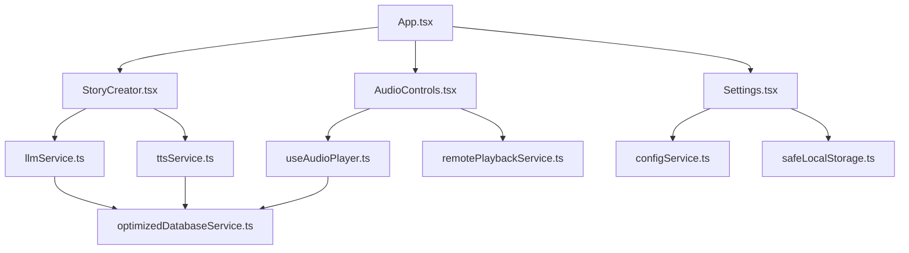

# 🗺️ Component Map & Navigation

## Quick Navigation
- [Frontend Components](#frontend-components) | [Backend Services](#backend-services)
- [Database Schema](#database-schema) | [API Endpoints](#api-endpoints)  
- [Dependencies](#dependencies) | [File Structure](#file-structure)

---

## Frontend Components

### 🎨 Component Hierarchy Tree
```
App.tsx (Main Container)
├── 🎭 Story Management
│   ├── StoryCreator.tsx         ➜ Story generation UI
│   ├── StoryCard.tsx           ➜ Story display component  
│   ├── StoryManagementPanel.tsx ➜ CRUD operations
│   ├── OptimizedStoryList.tsx   ➜ Performance-optimized list
│   └── SharedStoryViewer.tsx    ➜ Shared story viewer
├── 🎵 Audio System
│   ├── AudioControls.tsx        ➜ Playback controls
│   └── VoiceSelector.tsx        ➜ TTS voice selection
├── 👤 User Management  
│   ├── ProfileSelector.tsx      ➜ Child profile management
│   └── Settings.tsx            ➜ App configuration
├── 📚 Content Organization
│   ├── FavoritesPanel.tsx      ➜ Favorite stories
│   ├── SearchPanel.tsx         ➜ Story search interface
│   ├── SeriesManager.tsx       ➜ Story series management
│   ├── StoryQueuePanel.tsx     ➜ Story queue management
│   └── StoryTypeSelector.tsx   ➜ Category selection
├── 📊 Monitoring & Analytics
│   ├── AnalyticsDashboard.tsx  ➜ Usage analytics
│   └── PerformanceMonitor.tsx  ➜ System monitoring
├── 🛠️ Utilities
│   ├── ApiKeyHelp.tsx          ➜ API configuration help
│   └── ErrorBoundary.tsx       ➜ Error handling
└── 🎨 UI Components (ui/)       ➜ 16 Radix-based primitives
```

### 🔄 Component Interaction Flow


### 📱 Component Props Interface Map

#### Core Props Patterns
```typescript
// Story-related components
interface StoryProps {
  story: Story
  onUpdate?: (story: Story) => void
  onDelete?: (id: number) => void
  showActions?: boolean
}

// Audio-related components  
interface AudioProps {
  audioFile?: string
  onPlay?: (file: string) => void
  onStop?: () => void
  volume?: number
}

// Profile-related components
interface ProfileProps {
  profiles: Profile[]
  activeProfile?: Profile | null
  onProfileChange?: (profile: Profile) => void
  onCreateProfile?: (profile: CreateProfileInput) => void
}

// Settings components
interface SettingsProps {
  settings: AppSettings
  onSettingsChange?: (settings: Partial<AppSettings>) => void
  onReset?: () => void
}
```

---

## Backend Services

### 🏗️ Service Architecture Map
```
backend/
├── 🌐 server.js                 ➜ Express server & routing
├── 🗄️  database/
│   ├── db.js                   ➜ SQLite operations
│   ├── maintenance.js          ➜ DB cleanup & optimization  
│   └── backup.js              ➜ Backup/restore utilities
├── 🔒 middleware/
│   └── validation.js          ➜ Request validation (Joi)
├── 📊 monitoring/
│   └── metrics.js             ➜ Performance metrics
└── 🧪 tests/
    ├── server.test.js         ➜ API integration tests
    └── smoke-prod.test.js     ➜ Production smoke tests
```

### 🔌 Service Dependencies Graph
```
server.js
├── requires: express, pino, axios, dotenv
├── imports: database/db.js
├── imports: middleware/validation.js  
├── imports: monitoring/metrics.js
└── serves: /api/* endpoints, /health, /audio/*

database/db.js
├── requires: better-sqlite3
├── provides: story operations, profile management
├── provides: series operations, favorites
└── provides: analytics tracking

middleware/validation.js
├── requires: joi
├── validates: story creation requests
├── validates: TTS generation requests
└── sanitizes: user input data
```

---

## Database Schema

### 📊 Entity Relationship Diagram
```
┌─────────────────┐    ┌─────────────────┐    ┌─────────────────┐
│     profiles    │    │     series      │    │   favorites     │
├─────────────────┤    ├─────────────────┤    ├─────────────────┤
│ id (PK)         │    │ id (PK)         │    │ id (PK)         │
│ name            │    │ title           │    │ story_id (FK)   │
│ age             │    │ description     │    │ created_at      │
│ gender          │    │ created_at      │    └─────────────────┘
│ custom_prompt   │    └─────────────────┘             │
│ is_active       │              │                      │
└─────────────────┘              │                      │
         │                       │                      │
         │                       │                      │
    ┌────▼────────────────────────▼──────────────────────▼────┐
    │                    stories                              │
    ├─────────────────────────────────────────────────────────┤
    │ id (PK)                                                 │
    │ title                                                   │
    │ story_text                                              │
    │ story_type                                              │
    │ created_at                                              │
    │ audio_file                                              │
    │ child_name                                              │
    │ child_age                                               │
    │ series_id (FK) ──────────────────────────────────────┐  │
    │ profile_id (FK) ─────────────────────────────────────┐│  │
    └─────────────────────────────────────────────────────┼┼──┘
                                                          ││
    ┌─────────────────────────────────────────────────────┼┘
    │                analytics_events                     │
    ├─────────────────────────────────────────────────────┤
    │ id (PK)                                             │
    │ event_type                                          │
    │ event_data (JSON)                                   │
    │ timestamp                                           │
    └─────────────────────────────────────────────────────┘
```

### 🔗 Table Relationships
- **stories** ← **profiles** (many-to-one: profile creates stories)
- **stories** ← **series** (many-to-one: series contains stories)  
- **stories** → **favorites** (one-to-many: story can be favorited)
- **stories** → **analytics_events** (tracked via event logging)

---

## API Endpoints

### 🛣️ Endpoint Route Map
```
/api/
├── stories/
│   ├── GET    /                ➜ List stories (paginated)
│   ├── POST   /                ➜ Create story with AI
│   ├── GET    /:id             ➜ Get specific story
│   ├── PUT    /:id             ➜ Update story
│   └── DELETE /:id             ➜ Delete story + audio
├── tts/
│   └── POST   /                ➜ Generate audio from text
├── play/
│   └── POST   /:id             ➜ Play story on Pi speakers
├── profiles/
│   ├── GET    /                ➜ List profiles
│   ├── POST   /                ➜ Create profile  
│   ├── PUT    /:id             ➜ Update profile
│   ├── DELETE /:id             ➜ Delete profile
│   └── POST   /:id/activate    ➜ Set active profile
├── series/
│   ├── GET    /                ➜ List series
│   ├── POST   /                ➜ Create series
│   ├── GET    /:id/stories     ➜ Get series stories
│   └── DELETE /:id             ➜ Delete series
├── favorites/
│   ├── GET    /                ➜ List favorites
│   ├── POST   /                ➜ Add favorite
│   └── DELETE /:id             ➜ Remove favorite
└── analytics/
    ├── GET    /                ➜ Get usage stats
    └── POST   /events          ➜ Track event

/audio/
└── GET    /:filename           ➜ Serve audio files

/health                         ➜ Health check endpoint
```

### 🔄 Request/Response Flow
```
Client Request → Express Router → Validation Middleware → Service Logic → Database Operation → Response
     ↓              ↓                    ↓                    ↓              ↓               ↓
  JSON body    Route matching      Joi validation     Business logic    SQLite query    JSON response
```

---

## Dependencies

### 📦 Frontend Dependencies Tree
```
React 19 Ecosystem
├── react, react-dom           ➜ Core React framework
├── react-router-dom          ➜ Client-side routing
└── @types/react*             ➜ TypeScript definitions

UI & Styling  
├── @radix-ui/*               ➜ 16 accessible UI primitives
├── tailwindcss              ➜ Utility-first CSS framework
├── lucide-react             ➜ Icon library (600+ icons)
├── class-variance-authority  ➜ Component variant system
└── clsx, tailwind-merge     ➜ Conditional styling utilities

Build & Development
├── vite                     ➜ Build tool & dev server
├── @vitejs/plugin-react     ➜ React support for Vite
├── typescript              ➜ Type checking
├── eslint*                  ➜ Code linting
└── @types/node             ➜ Node.js type definitions

Audio & Notifications
├── sonner                   ➜ Toast notifications
└── [Native Web Audio API]   ➜ Audio playback (no deps)
```

### 🛠️ Backend Dependencies Tree  
```
Core Framework
├── express                  ➜ Web application framework
├── better-sqlite3          ➜ Fast SQLite driver
├── dotenv                  ➜ Environment variables
└── axios                   ➜ HTTP client for APIs

Logging & Monitoring
├── pino                    ➜ Fast JSON logger
├── pino-pretty            ➜ Pretty log formatter
└── pino-http              ➜ HTTP request logging

Validation & Security
└── joi                     ➜ Schema validation

Testing
├── jest                    ➜ Testing framework
└── supertest              ➜ HTTP assertion library
```

### 🔄 Dependency Flow Map
```
App.tsx imports → React hooks → Custom hooks → Services → Utils
                       ↓              ↓           ↓        ↓
                   useState,      useAudioPlayer  llmService  cache.ts
                   useEffect      useProfiles     ttsService  logger.ts
                                 useStoryDatabase configSvc   safeStorage
```

---

## File Structure

### 📁 Complete Directory Map
```
bedtime-stories-app/
├── 📄 Configuration Files
│   ├── package.json              ➜ Root dependencies & scripts
│   ├── tsconfig.json            ➜ TypeScript configuration  
│   ├── vite.config.js           ➜ Build configuration
│   ├── eslint.config.js         ➜ Linting rules
│   └── components.json          ➜ UI component configuration
│
├── 🎨 Frontend Source (src/)
│   ├── components/              ➜ React components (20 files)
│   │   ├── ui/                 ➜ Radix UI primitives (16 files)
│   │   ├── StoryCreator.tsx    ➜ Main story creation UI
│   │   ├── AudioControls.tsx   ➜ Audio playback interface
│   │   ├── Settings.tsx        ➜ Application settings
│   │   └── [17 more components]
│   ├── hooks/                  ➜ Custom React hooks (11 files)
│   │   ├── useAudioPlayer.ts   ➜ Audio state management
│   │   ├── useStoryDatabase.ts ➜ Database operations
│   │   ├── useProfiles.ts      ➜ Profile management
│   │   └── [8 more hooks]
│   ├── services/               ➜ Frontend services (9 files)
│   │   ├── llmService.ts       ➜ AI story generation
│   │   ├── ttsService.ts       ➜ Text-to-speech
│   │   ├── configService.ts    ➜ Configuration management
│   │   └── [6 more services]
│   ├── utils/                  ➜ Utility functions (10 files)
│   │   ├── cache.ts           ➜ Caching system
│   │   ├── stabilityMonitor.ts ➜ Pi Zero monitoring
│   │   ├── safeLocalStorage.ts ➜ Storage wrapper
│   │   └── [7 more utilities]
│   ├── lib/
│   │   └── utils.ts           ➜ General utilities (clsx, etc.)
│   ├── App.tsx                ➜ Main application component
│   ├── main.tsx               ➜ React entry point
│   └── index.css              ➜ Global styles
│
├── 🖥️ Backend Source (backend/)
│   ├── database/              ➜ Database layer
│   │   ├── db.js             ➜ SQLite operations
│   │   ├── maintenance.js     ➜ DB maintenance
│   │   ├── backup.js         ➜ Backup utilities
│   │   └── stories.db        ➜ SQLite database file
│   ├── middleware/
│   │   └── validation.js     ➜ Request validation
│   ├── monitoring/
│   │   └── metrics.js        ➜ Performance metrics
│   ├── tests/                ➜ Backend tests
│   │   ├── server.test.js    ➜ API integration tests
│   │   └── smoke-prod.test.js ➜ Production smoke tests
│   ├── audio/                ➜ Generated audio files
│   ├── server.js             ➜ Express server
│   ├── package.json          ➜ Backend dependencies
│   └── health-check.js       ➜ Health monitoring
│
├── 🧪 Testing (tests/)
│   ├── db.test.ts            ➜ Database tests
│   ├── server-health.test.ts ➜ Health check tests
│   └── run-tests.cjs         ➜ Test runner
│
├── 🚀 Deployment (deploy/)
│   ├── storyapp.service      ➜ Systemd service file
│   └── health-check.sh       ➜ Deployment health check
│
├── 📚 Documentation (docs/)
│   ├── PROJECT_INDEX.md      ➜ Comprehensive project docs
│   ├── COMPONENT_MAP.md      ➜ This navigation file
│   └── PRODUCTION_DEPLOYMENT_GUIDE.md ➜ Deployment guide
│
├── 🔧 Build Output
│   ├── dist/                 ➜ Built frontend assets
│   └── node_modules/         ➜ Dependencies
│
└── 📄 Project Files
    ├── README.md             ➜ Project overview & setup
    ├── CLAUDE.md             ➜ Claude Code instructions
    ├── Feature_Proposals.md   ➜ Feature wishlist
    ├── setup.sh              ➜ Automated deployment
    ├── check-setup.sh        ➜ Setup validation
    └── docker-compose.yml    ➜ Docker deployment
```

### 🎯 Key File Locations
```
Critical Configuration:
├── src/App.tsx                    ➜ Main app logic (1,244 lines)
├── backend/server.js              ➜ API server (production-ready)  
├── backend/database/db.js         ➜ Database operations
├── vite.config.js                 ➜ Build optimization (Pi Zero)
└── backend/.env                   ➜ API keys & configuration

Entry Points:
├── src/main.tsx                   ➜ Frontend bootstrap
├── backend/server.js              ➜ Backend bootstrap  
├── setup.sh                       ➜ Automated deployment
└── check-setup.sh                 ➜ Health validation

Production Assets:  
├── dist/                          ➜ Built frontend (686KB)
├── backend/audio/                 ➜ Generated MP3 files
├── backend/database/stories.db    ➜ SQLite database
└── deploy/storyapp.service        ➜ Systemd service
```

---

## 🧭 Navigation Quick Links

### 🔍 By Development Task
- **Add New Component** → `src/components/` → Update `App.tsx` imports
- **Add New Hook** → `src/hooks/` → Import in component
- **Add New Service** → `src/services/` → Add to service layer  
- **Add Database Table** → `backend/database/db.js` → Add CRUD operations
- **Add API Endpoint** → `backend/server.js` → Add route & validation
- **Add UI Primitive** → `src/components/ui/` → Follow Radix patterns

### 🐛 By Debugging Domain
- **Audio Issues** → `AudioControls.tsx` → `useAudioPlayer.ts` → `remotePlaybackService.ts`
- **Database Issues** → `useStoryDatabase.ts` → `backend/database/db.js`
- **API Issues** → `backend/server.js` → `middleware/validation.js`
- **Performance Issues** → `PerformanceMonitor.tsx` → `stabilityMonitor.ts`
- **Build Issues** → `vite.config.js` → `tsconfig.json` → `package.json`

### 📖 By Learning Path
- **Project Overview** → `README.md` → `CLAUDE.md`  
- **Architecture Deep Dive** → `PROJECT_INDEX.md` → Component source
- **API Integration** → API endpoints section → Backend tests
- **Deployment** → `PRODUCTION_DEPLOYMENT_GUIDE.md` → `setup.sh`
- **Development Setup** → Development commands → Component examples

This component map provides complete project navigation with visual hierarchy, dependency graphs, and quick reference paths for efficient development and maintenance.